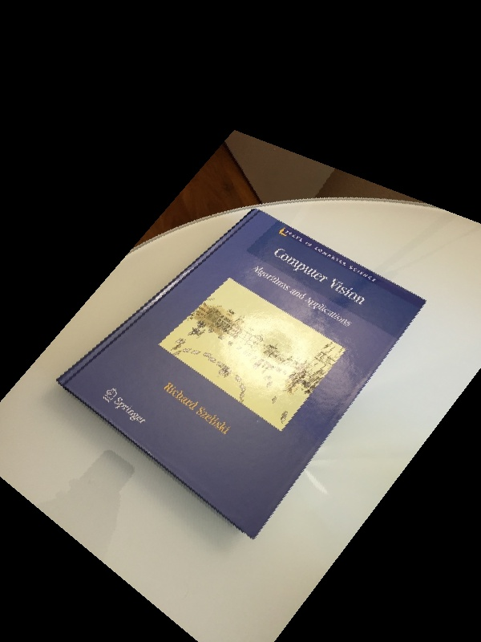
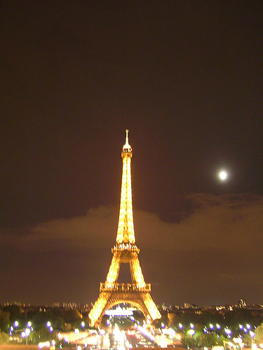

# **A2 : Warping, Matching, Stitching, Blending**

# **Part1**
## **Results**
eiffel_18.jpg eiffel_19.jpg 

bigben_6.jpg bigben_8.jpg 


part1-images/eiffel_19.jpg part1-images/eiffel_1.jpg part1-images/eiffel_3.jpg 

part1-images/bigben_2.jpg part1-images/bigben_3.jpg part1-images/bigben_8.jpg part1-images/bigben_6.jpg part1-images/bigben_10.jpg part1-images/eiffel_18.jpg part1-images/eiffel_6.jpg 

### How it works:
It follows the basic idea of k-means clustering by grouping pictures that are closer to each other(shares more distinct feature points).
##### Test code:
```python
python part1.py 2 bigben_6.jpg bigben_8.jpg eiffel_18.jpg eiffel_19.jpg part1_output.txt
python a2.py part1 2 bigben_6.jpg bigben_8.jpg eiffel_18.jpg eiffel_19.jpg part1_output.txt
```
### Assumptions:
Feature points can be detected efficiently with cv2.ORB_create() before further processing.
Pictures of the same category should share significantly more distinct features than pictures of different categories. 
### Problems faced:
The number of shared distinct feature is not largely affected by if two picture belongs to the same category or not, and in some cases picture from different categories can share more distinct feature than picture in the same category.
### Simplifications:
To shorten the time of the whole process, I decided to compute a distance matrix of all possible pairs of data points in the data and use the index as reference when doing clustering in K-Medoids.
### Design decisions:
Tried to use K-Means as the method but ran into problem creating new centroids that minimize the distance from other in-group feature vectors. So, I turned to K-Medoids which uses existing points in data as the new centroids. Which is not so time efficient but also not too bad, and it overcomes the difficulty facing by using K-Means.

# **Part2**
## **Results**
 


### How it works:
Taking in two images and transform one of them base on the spatial layout of the other image.
This is accomplished using pairs of corresponding points to compute the transformation matrix which can transpose the original
image using inverse warping and bilinear interpolation.

##### Test code:
```python
python a2.py part2 4 book1.jpg book2.jpg book_output.jpg 318,256 141,131 534,372 480,159 316,670 493,630 73,473 64,601
```

### Assumptions:
The pair-wise coordinates should come from the detection of similar set of features in two images,
which should guarantee a close match between two images after transforming using the calculated matrix. 

### Problems faced:
For the example shown in the instruction, the model worked well. However, for cases where two images are of different size,
or when object sizes in two images are significantly different, the transformed result would lost lots of details in the 
original images since some part can be out side of the image after transformation.


### Design decisions:
To better blend in with the overall workflow, we decide to pre-process the pictures by adding black boarders around all 
sides of the original images, which leaves enough space for image stitching and keeps all original information. 


# **Part3**
## **Results**
   

 

 

### How it works:
This part would be a step more than part 2 and absorbs the function from part 1.
It takes two images and auto-detect and transform one of the image to be in the 
same coordinate system of the other, and then stitch them together as well as keeping
all the original information. This method uses RANSAC to get feature points that 
can be used to calculate the transformation matrix between two images.

##### Test code:
```python
python a2.py part3 eiffel_18.jpg eiffel_19.jpg part3_demo.jpg
```

### Assumptions:
The RANSAC algorithm would work well and retract enough coordinates for corresponding
feature points. And these coordinates can represent the spatial relationship
between two pictures including shifting, rotation, etc.

### Problems faced:
Result coordinates can be too much for matrix transformation and some of those are not
really "usable", since they can be either covering un-important part of the 
images or does not explain the spatial relationship well.

### Design decisions:
We overcame this by check the spatial relationship between output coordinates
 after dividing them into groups, which ensures the coordinate used to calculate
 the transformation matrix will produce reliable results. 
